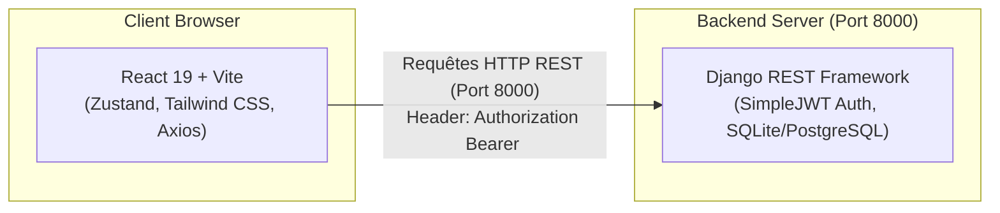

# 📦 EcoStock - Guide d'Installation & d'Exécution Complet (Full Stack)

Ce document est le **README unifié** de la solution **EcoStock**. Il explique comment installer, configurer et exécuter l'application complète, regroupant l'API Backend (Django REST Framework) et l'application Web Frontend (React + Vite).

---

## 📋 Table des matières

1. [Présentation du projet](#1-présentation-du-projet)
2. [Architecture Technologique](#2-architecture-technologique)
3. [Prérequis Systèmes](#3-prérequis-systèmes)
4. [Guide d'Installation et Lancement Pas à Pas](#4-guide-dinstallation-et-lancement-pas-à-pas)
   - [Étape 1 : Démarrer le Backend (API Django)](#étape-1--démarrer-le-backend-api-django)
   - [Étape 2 : Démarrer le Frontend (React + Vite)](#étape-2--démarrer-le-frontend-react--vite)
5. [Aperçu Rapide des Commandes (Cheatsheet)](#5-aperçu-rapide-des-commandes-cheatsheet)
6. [Variables d'Environnement](#6-variables-denvironnement)
7. [Fonctionnalités & Endpoints API](#7-fonctionnalités--endpoints-api)
8. [Workflow Métier (Transfert de Produits)](#8-workflow-métier-transfert-de-produits)
9. [Structure des Projets](#9-structure-des-projets)
10. [Dépannage & Erreurs Courantes (Troubleshooting)](#10-dépannage--erreurs-courantes-troubleshooting)

---

## 1. Présentation du projet

**EcoStock** est une solution complète de gestion d'inventaire et d'entreposage permettant de :
- Consulter et gérer la liste des entrepôts (création, modification, suppression, calcul d'audit de capacité).
- Gérer les stocks de produits (création, quantité, date de péremption, réaffectation).
- Effectuer des transferts sécurisés de produits d'un entrepôt à un autre avec vérification des règles métier (non-expiration, existence des entrepôts).
- Authentifier les utilisateurs via des jetons sécurisés **JWT** (JSON Web Tokens).

---

## 2. Architecture Technologique



- **Backend** : Python 3.10+, Django, Django REST Framework (DRF), `djangorestframework-simplejwt`, Base de données SQLite.
- **Frontend** : Node.js, React 19, Vite, Zustand (Gestion d'état), React Router v7, Tailwind CSS, Axios, Lucide React, Shadcn UI.

---

## 3. Prérequis Systèmes

Avant de commencer, vérifiez que votre machine dispose des outils suivants :

- **Python** (version 3.10 ou supérieure) : `python --version`
- **Node.js** (version 18 ou supérieure) & **pnpm** (ou npm) : `node -v` et `pnpm -v`
- **Git** : pour récupérer les dépôts de code.

---

## 4. Guide d'Installation et Lancement Pas à Pas

Pour faire tourner l'application complète, vous devez exécuter le **Backend** et le **Frontend** simultanément dans deux fenêtres de terminal distinctes.

---

### Étape 1 : Démarrer le Backend (API Django)

1. **Naviguez vers le dossier du backend** :
   ```bash
   cd path/to/ecoStock
   ```

2. **Créer et activer un environnement virtuel Python** :
   - *Sur Windows (PowerShell)* :
     ```powershell
     python -m venv .venv
     .\.venv\Scripts\Activate.ps1
     ```
   - *Sur Linux / macOS* :
     ```bash
     python3 -m venv .venv
     source .venv/bin/activate
     ```

3. **Installer les dépendances requises** :
   ```bash
   pip install -r requirements.txt
   ```
   *(Si `requirements.txt` n'est pas présent, installez : `pip install django djangorestframework djangorestframework-simplejwt django-cors-headers`)*

4. **Appliquer les migrations de base de données** :
   ```bash
   python manage.py migrate
   ```

5. **Créer un compte administrateur (Superuser)** pour vous connecter :
   ```bash
   python manage.py createsuperuser
   ```

6. **(Optionnel) Alimenter la base avec des données de test** :
   ```bash
   python manage.py shell
   ```
   Puis dans le shell Python :
   ```python
   from warehouse.models import WareHouse
   from produits.models import Product
   from django.utils import timezone

   w1 = WareHouse.objects.create(name="Entrepôt Central", location="Dakar", capacity=500)
   w2 = WareHouse.objects.create(name="Entrepôt Annexe", location="Thies", capacity=200)

   Product.objects.create(name="Jus d'Orange 1L", quantity=100, expiration_date=timezone.now().date(), warehouse=w1)
   exit()
   ```

7. **Lancer le serveur de développement Django** :
   ```bash
   python manage.py runserver 8000
   ```
   L'API est désormais accessible sur : **`http://127.0.0.1:8000/`**

---

### Étape 2 : Démarrer le Frontend (React + Vite)

1. **Ouvrez un second terminal** et naviguez vers le dossier du frontend :
   ```bash
   cd path/to/ecostock-frontend
   ```

2. **Installer les dépendances Node.js** :
   ```bash
   pnpm install
   # ou si vous utilisez npm : npm install
   ```

3. **Configurer les variables d'environnement** :
   Créer un fichier `.env` à la racine de `ecostock-frontend` contenant :
   ```env
   VITE_API_URL=http://127.0.0.1:8000/api
   ```

4. **Lancer l'application Frontend** :
   ```bash
   pnpm dev
   # ou avec npm : npm run dev
   ```

5. **Accéder à l'application Web** :
   Ouvrez votre navigateur sur l'adresse indiquée par Vite (généralement **`http://localhost:5173/`**).

---

## 5. Aperçu Rapide des Commandes (Cheatsheet)

| Composant | Dossier | Commande d'activation | Commande d'exécution | URL par défaut |
| :--- | :--- | :--- | :--- | :--- |
| **Backend** | `ecoStock/` | `.\.venv\Scripts\Activate.ps1` | `python manage.py runserver 8000` | `http://127.0.0.1:8000/` |
| **Frontend** | `ecostock-frontend/` | N/A | `pnpm dev` | `http://localhost:5173/` |

---

## 6. Variables d'Environnement

### Frontend (`ecostock-frontend/.env`)
```env
VITE_API_URL=http://127.0.0.1:8000/api
```
*(Remarque : Ajustez l'URL selon le préfixe configuré dans votre routeur Django Backend, ex: `http://127.0.0.1:8000/api` ou `http://127.0.0.1:8000/api/v1`)*

---

## 7. Fonctionnalités & Endpoints API

### 🔐 Authentification (JWT)
- `POST /api/v1/token/` : Obtenir un jeton d'accès (`access`) et de rafraîchissement (`refresh`).
- `POST /api/v1/token/refresh/` : Obtenir un nouveau jeton d'accès.

### 📦 Produits (`/api/v1/products/`)
- `GET /api/v1/products/` : Lister l'ensemble des produits.
- `POST /api/v1/products/` : Ajouter un nouveau produit.
- `GET /api/v1/products/{id}/` : Consulter les détails d'un produit.
- `PUT / PATCH /api/v1/products/{id}/` : Modifier un produit.
- `DELETE /api/v1/products/{id}/` : Supprimer un produit.
- `POST /api/v1/products/{id}/move/` : Déplacer un produit vers un autre entrepôt.

### 🏢 Entrepôts (`/api/v1/warehouse/`)
- `GET /api/v1/warehouse/` : Lister les entrepôts.
- `POST /api/v1/warehouse/` : Créer un entrepôt.
- `GET /api/v1/warehouse/{id}/` : Détails d'un entrepôt.
- `PUT / PATCH /api/v1/warehouse/{id}/` : Mettre à jour un entrepôt.
- `DELETE /api/v1/warehouse/{id}/` : Supprimer un entrepôt.
- `GET /api/v1/warehouse/{id}/audit/` : Effectuer un audit de l'entrepôt.

---

## 8. Workflow Métier (Transfert de Produits)

Lorsqu'un utilisateur initie un transfert de produit depuis l'interface ou l'API, les validations suivantes sont exécutées côté Backend :

```mermaid
flowchart TD
    A[Requête POST /products/{id}/move/] --> B{Le produit existe-t-il ?}
    B -- Non --> C[Erreur 400 - Produit introuvable]
    B -- Oui --> D{Champ 'warehouse' présent ?}
    D -- Non --> E[Erreur 400 - Champ obligatoire]
    D -- Oui --> F{L'entrepôt cible existe-t-il ?}
    F -- Non --> G[Erreur 400 - Entrepôt introuvable]
    F -- Oui --> H{Date d'expiration valide ?}
    H -- Expirée --> I[Erreur 400 - Déplacement refusé]
    H -- Valide --> J[Mettre à jour l'entrepôt du produit]
    J --> K[Succès 200 - Produit déplacé]
```

---

## 9. Structure des Projets

```text
.
├── ecoStock/                      # Dépôt Backend (Django)
│   ├── config/                    # Configuration du projet Django (settings, urls)
│   ├── produits/                  # Application Django de gestion des produits
│   ├── warehouse/                 # Application Django de gestion des entrepôts
│   ├── db.sqlite3                 # Base de données SQLite locale
│   ├── manage.py                  # Script de gestion Django
│   └── requirements.txt           # Dépendances Python
│
└── ecostock-frontend/             # Dépôt Frontend (React + Vite)
    ├── public/                    # Assets statiques
    ├── src/
    │   ├── apis/                  # Requêtes Axios vers le Backend
    │   ├── components/            # Composants UI réutilisables (shadcn/ui)
    │   ├── pages/                 # Écrans de l'application (Dashboard, Products, Warehouses)
    │   ├── stores/                # States Zustand (Auth, Products, Warehouses)
    │   ├── utils/                 # Intercepteur Axios & Helpers
    │   ├── main.jsx               # Point d'entrée & Routage React Router
    │   └── layout.jsx             # Shell & Layout principal
    ├── .env                       # Configuration de l'URL API
    ├── package.json               # Dépendances et scripts Node.js
    └── vite.config.js             # Configuration du bundler Vite
```

---

## 10. Dépannage & Erreurs Courantes (Troubleshooting)

### 1. Erreur CORS (`Cross-Origin Request Blocked`)
- **Symptôme** : Les requêtes HTTP échouent depuis le navigateur avec un message CORS dans la console.
- **Solution** : Vérifiez que `django-cors-headers` est installé côté Django et que `CORS_ALLOW_ALL_ORIGINS = True` (ou l'origine `http://localhost:5173`) est ajouté dans `config/settings.py`.

### 2. Erreur `401 Unauthorized` lors des requêtes
- **Symptôme** : Impossible de récupérer les produits ou entrepôts.
- **Solution** : Connectez-vous via l'écran `/login` avec vos identifiants d'utilisateur Django superuser créés précédemment (`python manage.py createsuperuser`).

### 3. PowerShell bloque l'activation du VENV
- **Symptôme** : `cannot be loaded because running scripts is disabled on this system`.
- **Solution** : Lancez la commande suivante dans PowerShell en administrateur :
  ```powershell
  Set-ExecutionPolicy -ExecutionPolicy RemoteSigned -Scope CurrentUser
  ```

---

### 💡 Besoin d'assistance ?
Consultez les fichiers de configuration ou ouvrez un ticket dans l'un des deux dépôts du projet.
